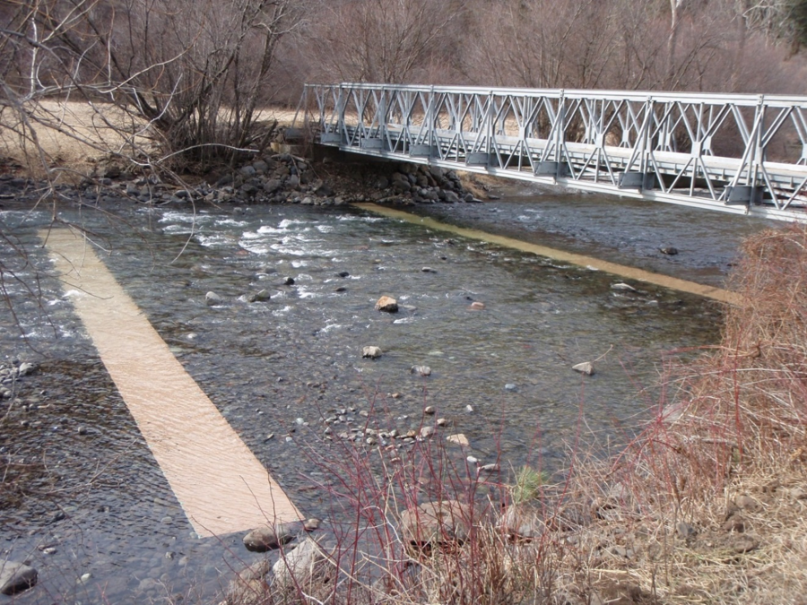
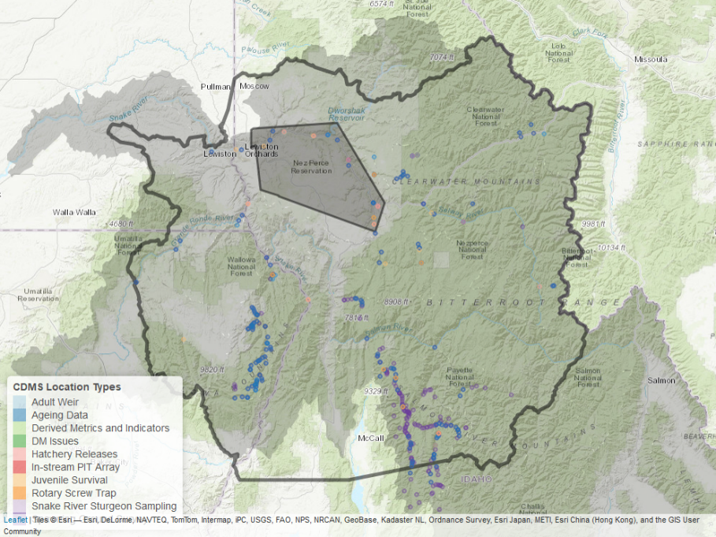
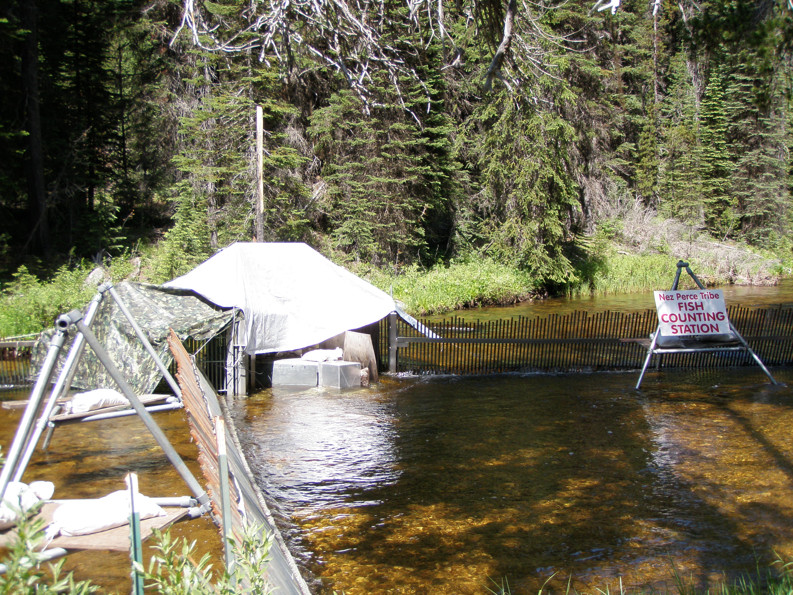

class: inverse, left, top
background-image: url("figures/Picture1.jpg")

.pull.right[
## Outline


.outline[
Catchy Hook <br/>
DFRM Responsibilities <br/>
My Experience and Background <br/>
Tools Used <br/>
Fishy Examples <br/>
]
]
<!-- -->
<!-- .large[Ryan N. Kinzer | Smolt Monitoring Workshop | 6th November 2019] -->

---
class: inverse, left, middle
## Catchy Hook - [PITtrackR](https://nptfisheries.shinyapps.io/PITtrackR/)

.bold[Problem Statement:] After migrating anadromous fish past Lower Granite Dam, the ability to update and make in-season adjustments to tribal and sport-fishing harvest rates, or weir management ceased.

.bold[Fix:] Need a way to track fish reaching terminal spawning areas and hatchery weirs.

.center[]

---
class: inverse, left, middle
## Catchy Hook - [PITtrackR](https://nptfisheries.shinyapps.io/PITtrackR/)




---
class: inverse, left, middle
## Catchy Hook - [PITtrackR](https://nptfisheries.shinyapps.io/PITtrackR/)

.center[
```{r map_iptds, eval = TRUE, echo = FALSE, warning=FALSE, message=FALSE, fig.width = 7}
library(tidyverse)
library(leaflet)

# load points and rivers
load("../../DFRM Projects/River_Mapping/data/points/site_config.rda")
load("../../DFRM Projects/River_Mapping/data/flowlines/large_rivers.rda")
#load("../../DFRM Projects/River_Mapping/data/flowlines/SR_streams.rda")
snake_rivers <- sf::st_transform(snake_rivers, crs = 4326)

sites <- configuration %>%
    filter(!is.na(Longitude)) %>%
    select(SiteID, StartDate, SiteName, SiteDescription, SiteTypeName,
         Latitude, Longitude) %>%
  distinct() %>%
  filter(grepl("Instream", SiteTypeName)) %>%
  
  sf::st_as_sf(coords = c('Longitude','Latitude'),
           crs = 4326)

leaflet() %>%
  #addTiles() %>%
  setView(lng = -115.5660,
          lat = 44.9218,
          zoom = 9) %>%
  addProviderTiles(providers$Esri.WorldTopoMap) %>%
  addPolylines(data = snake_rivers, color = 'cyan') %>%
  addCircleMarkers(data = sites)
```
]
---

class:  center

.dfrm[Department of Fisheries Resources Management]

Administration | Harvest | Conservation Enforcement <br/>
Production | Watershed | Research

.bold[Mission Statement]

.left[The Nez Perce Tribe Department of Fisheries Resources Management will protect and restore aquatic resources and habitats. Our mission will be acccomplished consistent with the Nimiipuu way of life and beliefs, which have the utmost respect for the Creator, for all species, and for the past, present, and future generations to come. Our mission will be consistent with the reserved rights stated within the Nez Perce Tribe's 1855 Treaty.]
---

class:  center

.dfrm[Department of Fisheries Resources Management]

Administration | Harvest | Conservation Enforcement <br/>
Production | Watershed | Research



---

## My Experience and Background

* Seasonal Bio-Aid - 1998 - 2001
  * B.S. Wildlife Sciences - 2001
* Field Technician - 2001-2003
* Field Biologist - 2003-2010
  * Started Master's Program
* Project Leader - 2010-2014
* Research Scientist - 2014-present



---

## Tools Used

MS SQL Server
R and R Studio

---

## Example 2 - [PITPH](https://nptfisheries.shinyapps.io/pitph2/)
PITPH

---

## Example 3
STADEM and DABOM


---

## Example 5
CAX

## Example 6
Forecasting


