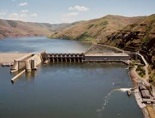
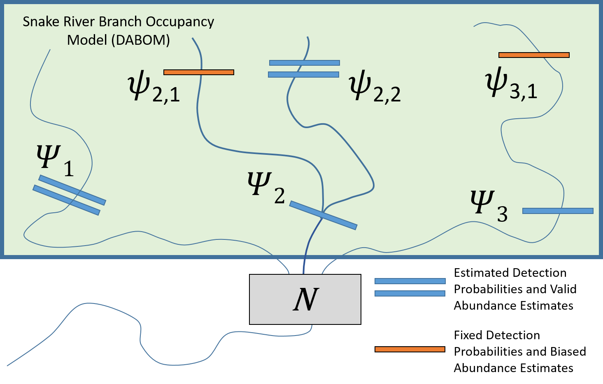

```{r map_iptds, eval = FALSE, echo = FALSE, warning=FALSE, message=FALSE, fig.width = 7}
library(tidyverse)
library(leaflet)
library(htmlwidgets)
library(htmltools)

library(cdmsR)
cdmsLogin('apikey', 'apikey')
cdms_sites <- get

# load points, rivers and polygons
load("../../DFRM Projects/River_Mapping/data/points/site_config.rda")
load("../../DFRM Projects/River_Mapping/data/points/cdms_locations.rda")
load("../../DFRM Projects/River_Mapping/data/flowlines/large_rivers.rda")
load("../../DFRM Projects/River_Mapping/data/polygons/SR_pops.rda")
load("../../DFRM Projects/River_Mapping/data/polygons/npt_boundaries.rda")

#load("../../DFRM Projects/River_Mapping/data/flowlines/SR_streams.rda")
snake_rivers <- sf::st_transform(snake_rivers, crs = 4326)
pnw_rivers <- sf::st_transform(pnw_rivers, crs = 4326)

# NPT areas

l <- leaflet() %>%
  #addTiles() %>%
  setView(lng = -115.5660,
          lat = 45.4000,#44.9218,
          zoom = 7) %>%
  addProviderTiles(providers$Esri.WorldTopoMap)%>%
  addPolylines(data = pnw_rivers, color = 'blue', weight = 1) %>%
  addPolylines(data = snake_rivers, color = 'blue', weight = 1)

co_type <- colorFactor('Paired', locs$LocationType)

npt_locs <- l %>%
  addPolygons(data = sth_pop,
              stroke = FALSE,
              color = 'grey',
              fillColor = 'grey',
              fillOpacity = .5,
              group = 'Snake Basin') %>%
  addPolygons(data = icc,
              stroke = TRUE,
              color = 'black',
              fill = NA,
              group = 'Indian Claims Commission') %>%
  addPolygons(data = npt1863,
              stroke = TRUE,
              color = 'blue',
              fill = NA,
              group = 'Treaty 1863') %>%
  addCircles(lat = locs$Latitude, lng = locs$Longitude, color = co_type(locs$LocationType), radius = 100,
           popup = paste("<b>Location Label:</b>", locs$Label, "<br>"),
           popupOptions = popupOptions(noHide = T, textsize = "15px"),
           highlightOptions = highlightOptions(color = "white",
                                               weight = 5, bringToFront = F, opacity = 1)) %>%
  #addControl(st_title, position = 'topleft', className = "map-title") %>%
  addLegend(position = 'bottomleft',
            title = 'Monitoring Locations', pal = co_type,
            values = unique(locs$LocationType)) %>%
  addLegend(position = "bottomleft",
            title = 'Boundaries', colors = c('grey', 'black', 'blue'),
            labels = c("Snake Basin", "Indian Claims Commission", "Treaty 1863"),
            group = c("Snake Basin", "Indian Claims Commission", "Treaty 1863"),
            opacity = 1) %>%

  addLayersControl(
    overlayGroups = c("Snake Basin", "ICC Boundary", "Treaty 1863"),
    options = layersControlOptions(collapsed = FALSE)
  )

path <- file.path(getwd(), "figures", "npt_locations.html")
saveWidget(npt_locs, file = path)

# sth pops and pit locatons
sites <- configuration %>%
    filter(!is.na(Longitude)) %>%
    select(SiteID, SiteName, SiteDescription, SiteTypeName,
         Latitude, Longitude) %>%
  mutate(type = case_when(
    grepl('Instream Remote', SiteTypeName) ~ 'In-stream Array',
    grepl('Weir|Hatchery', SiteName) ~ 'Weir Scanning',
    grepl('Adult Fishway', SiteTypeName) ~ 'Ladder Observation',
    SiteTypeName == 'Dam' ~ 'Dam')
    ) %>%
  distinct() %>%
  #filter(grepl("Instream", SiteTypeName)) %>%
  sf::st_as_sf(coords = c('Longitude','Latitude'),
           crs = 4326)

st_copop <- colorFactor(palette = 'viridis', domain = sth_pop$POP_NAME)

array <- filter(sites, type == 'In-stream Array')
weirs <- filter(sites, type == 'Weir Scanning')
ladder <- filter(sites, type == 'Ladder Observation')
dam <- filter(sites, type == 'Dam')

tmp_config <- filter(sites, !is.na(type))

pal <- colorFactor(
  palette = topo.colors(9)[1:3],
  #reverse = TRUE,
  domain = tmp_config$type
)

#tmp_config <- filter(sites, grepl("Dam", SiteTypeName))

tag.map.title <- tags$style(HTML("
  .leaflet-control.map-title { 
    transform: translate(-50%,20%);
    position: fixed !important;
    left: 50%;
    text-align: center;
    padding-left: 10px; 
    padding-right: 10px; 
    background: rgba(255,255,255,0.75);
    font-weight: bold;
    font-size: 16px;
  }
"))

st_title <- tags$div(
  tag.map.title, HTML("Snake Basin Steelhead Populations")
)

pit_locs <- l %>%
  addPolygons(data = sth_pop,
              popup = ~as.character(POP_NAME),
              label = ~TRT_POPID,
              layerId = sth_pop$POP_NAME,
              group = 'Populations',
              stroke = TRUE, color = 'black',
              fillColor = ~st_copop(POP_NAME), weight = 1, fillOpacity = .5) %>%
  addCircleMarkers(data = array, radius = 5,
                   group = 'In-Stream Arrays',
                   popup = paste("<b>Site ID:</b>", array$SiteID),
                   color = ~pal(array$type),
                  #clusterOptions = markerClusterOptions(),
                  popupOptions = popupOptions(noHide = T)) %>%
  addCircleMarkers(data = weirs, radius = 5,
                   group = 'Weir Scanning',
                   popup = paste("<b>Site ID:</b>", weirs$SiteID),
                   color = ~pal(weirs$type),
                  #clusterOptions = markerClusterOptions(),
                  popupOptions = popupOptions(noHide = T)) %>%
  addCircleMarkers(data = ladder, radius = 5,
                   group = 'Ladder Observation',
                   popup = paste("<b>Site ID:</b>", ladder$SiteID),
                   color = ~pal(ladder$type),
                  #clusterOptions = markerClusterOptions(),
                  popupOptions = popupOptions(noHide = T)) %>%
  addCircleMarkers(data = dam, radius = 5,
                   group = 'Dam',
                   popup = paste("<b>Site ID:</b>", dam$SiteID),
                   color = ~pal(dam$type),
                  #clusterOptions = markerClusterOptions(),
                  popupOptions = popupOptions(noHide = T)) %>%
  #addControl(st_title, position = 'topleft', className = "map-title") %>%
  addLegend(data = tmp_config, position = "bottomleft", pal = pal, values = ~type,
          title = "Observation Type",
          #labFormat = labelFormat(prefix = "$"),
          opacity = 1) %>%
  addLayersControl(
    overlayGroups = c("Populations", "In-Stream Arrays", "Ladder Observations", "Weir Scanning", "Dam"),
    options = layersControlOptions(collapsed = FALSE)
  )

path <- file.path(getwd(), "figures", "pit_locations.html")
saveWidget(pit_locs, file = path)
```


class: inverse, left, top
background-image: url("figures/Picture1.jpg")
background-position: bottom 15px left 20px
background-size: 65%

.pull.right[
## Outline

.outline[
DFRM Responsibilities <br/>
Set the Stage  <br/>
Fishy Examples <br/>
  ]
]

--
<br/>
.pull.right[

]
<!-- -->
<!-- .large[Ryan N. Kinzer | Smolt Monitoring Workshop | 6th November 2019] -->

---

class:  center
background-image: url("figures/NPT.png"), url("figures/DFRM.png")
background-position: top 15px left 20px, top 15px right 20px
background-size: 100px, 100px

.dfrm[Department of Fisheries Resources Management]

Administration | Harvest | Conservation Enforcement <br/>
Production | Watershed | Research

<hr/>

.bold[Mission Statement]

.left[The Nez Perce Tribe Department of Fisheries Resources Management will protect and restore aquatic resources and habitats. Our mission will be acccomplished consistent with the Nimiipuu way of life and beliefs, which have the utmost respect for the Creator, for all species, and for the past, present, and future generations to come. Our mission will be consistent with the reserved rights stated within the Nez Perce Tribe's 1855 Treaty.]

--
<br/>
.mission[Restore the landscape, and leave it better than before for our children.]

---
class:  mainslide, left, top

## Research Division

<iframe  title="My Map" width="1500" height="500" src="figures/npt_locations.html" frameborder="0" allowfullscreen></iframe>

---
background-image: url("figures/ptagis.png")
background-position: top 15px right 40px
background-size: 150px, 150px

## Set the stage...
<div class="row">
  <div class="column">
    
    

  </div>
  <div class="column">
    
    
  </div>
</div>

---
background-image: url("figures/ptagis.png")
background-position: top 15px right 40px
background-size: 150px, 150px

## Set the stage...
<div class="row">
  <div class="column">
    
  </div>
  <div class="column">
    
    
  </div>
</div>

---
class: mainslide, left, top
layout: true

---

## PIT-tag Uses

* Abundance: Lincoln-Peterson
$$\hat{N} = \frac{M*C}{R}$$
* Survival: Cormack Jolly Seber
$$z_{i,t+1}|z_{i,t} \sim Bernoulli(z_{i,t} \phi_{i,t})$$
$$y_{i,t}|z_{i,t} \sim Bernoulli(z_{i,t} \rho_{i,t})$$
* In-season Management: Tag-expansions
$$\hat{N} = \frac{n_a}{(\frac{n_j}{N_j})}$$
* Juvenile and Adult Arrival and Travel Times

---

## PIT-tag Observations

<iframe  title="My Map" width="1500" height="500" src="figures/pit_locations.html" frameborder="0" allowfullscreen></iframe>

---

## Management Example 1 - [PITtrackR](https://nptfisheries.shinyapps.io/PITtrackR/)

.bold[Need:] Real-time in-season harvest management.

.bold[Problem:] After fish past Lower Granite Dam we lose the ability to make in-season adjustments to tribal and sport-fishing harvest rates.

.bold[Fix:] Track fish reaching terminal spawning areas and hatchery weirs with PIT-tags.

.center[
<a href="https://nptfisheries.shinyapps.io/PITtrackR/">

</a>
]

---

## Management Example 2 - Pop. Abundance

.bold[Need:] Natural-origin spring/summer Chinook and steelhead abundance for ESA status assessments. 

.bold[Problem:] Current methods are too expensive, impossible, or not accurate/precise enough in all locations.

.bold[Fix:] In-stream PIT-tag arrays, STADEM and DABOM

.pull-left[

]

.pull-right[

]

---
layout: false
## Management Example 2 - Pop. Abundance

---

## Management Example 2 - Pop. Abundance

---

## Management Example 2 - Pop. Abundance

---

## Management Example 2 - Pop. Abundance

---

## Management Example 2 - Pop. Abundance

---

## Management Example 2 - Pop. Abundance


---
class: mainslide, left, top
layout: true
---

## Management Example 2 - STADEM
State-space Adult Dam Escapement Model - $\hat{N}$


---
## Management Example 2 - DABOM
Dam Adult Branch Occupancy Model - Transition Probabilities


---
## Management Example 2 - DABOM
Steelhead - Population Abundance


---
## Management Example 2 - DABOM
Steelhead - South Fork Salmon River

.center[

]

---

## Management Example 3 - [PITPH](https://nptfisheries.shinyapps.io/pitph2/)

.bold[Need:] Lower power house encounters to improve smolt-to-adult return rates. 

.bold[Problem Statement:] Regulatory and fish management folks had different views of the interaction between dam operations and fish survival.

.bold[Fix:] Developed interactive application to communicate the issue, balance desired outcomes and find compromises.

.bold[Outcome:] Spill operations agreement signed by 3 state governors.

---

## Management Example 3 - [PITPH](https://nptfisheries.shinyapps.io/pitph2/)

.center[
<a href="https://nptfisheries.shinyapps.io/pitph2/">

</a>
]

???
.bold[Learned:]
* Find a metric that is important to both parties.

.bold[Balance Outcomes:]

.bold[Compromise:] Signed spill operations agreement

fish abundance - they are not responsible for reso

tangible fish response  - professional biologist opinion

---

## Conclusions